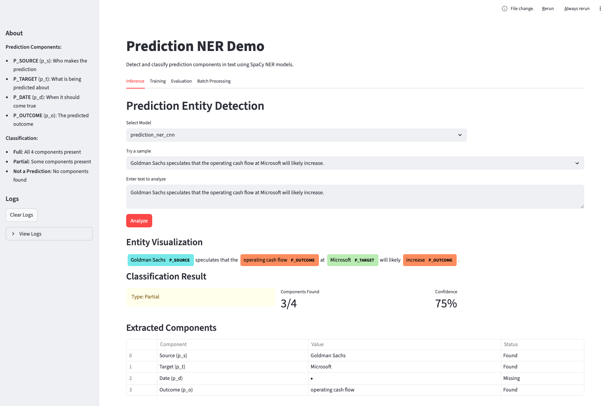

# Prediction NER Demo

A SpaCy-based Named Entity Recognition system for detecting prediction components in text, with a Streamlit interface for training and inference.



## Overview

This module extracts structured prediction information from natural language text. A prediction is defined as a 4-tuple `<p> = (<p_s>, <p_t>, <p_d>, <p_o>)`:

| Component | Label | Description | Example |
|-----------|-------|-------------|---------|
| **Source** | `P_SOURCE` | Who makes the prediction | "Morgan Stanley", "Goldman Sachs" |
| **Target** | `P_TARGET` | What is being predicted about | "S&P 500", "Microsoft", "inflation rate" |
| **Date** | `P_DATE` | When the prediction should come true | "Q2 2025", "September 15, 2025" |
| **Outcome** | `P_OUTCOME` | The predicted outcome/metric | "stock price will rise", "revenue will fall" |

### Classification

- **Full Prediction**: Contains all 4 components
- **Partial Prediction**: Contains 1-3 components
- **Not a Prediction**: Contains no prediction components

## Installation

The module uses dependencies from the parent project. Ensure you have synced:

```bash
uv sync
```

For transformer-based models (optional), you need `spacy-transformers` which has a version conflict with the existing `transformers` package. To use transformer models, you would need to resolve this conflict manually.

## Quick Start

### Launch the Streamlit App

```bash
uv run streamlit run prediction_demo/app.py
```

The app provides four tabs:

1. **Inference**: Analyze individual texts for prediction components
2. **Training**: Train CNN or transformer NER models
3. **Evaluation**: Compare model performance on test data
4. **Batch Processing**: Process CSV files with multiple texts

### Programmatic Usage

```python
from prediction_demo.models.prediction_ner import PredictionNER
from prediction_demo.models.prediction_classifier import PredictionClassifier

# Load a trained model
ner = PredictionNER("output/models/prediction_ner_cnn/model-best")
classifier = PredictionClassifier(ner)

# Classify text
result = classifier.classify(
    "Morgan Stanley predicts that the S&P 500 will rise in Q2 2025."
)

print(f"Type: {result.prediction_type.value}")
print(f"Source: {result.components.source}")
print(f"Target: {result.components.target}")
print(f"Date: {result.components.date}")
print(f"Outcome: {result.components.outcome}")
```

### Train a Model

```python
from prediction_demo.training.trainer import quick_train

result = quick_train(
    data_dir="data/tagging/official",
    output_dir="output",
    model_type="cnn",
    max_steps=5000,
)
print(f"Model saved to: {result.model_path}")
print(f"Best F1 score: {result.best_score:.2%}")
```

### Train with Custom Model Name

```python
from prediction_demo.training.trainer import Trainer, TrainingConfig

config = TrainingConfig(
    model_type="cnn",
    model_name="my_custom_model",  # Custom name instead of auto-generated
    max_steps=5000,
    dropout=0.1,
    learning_rate=0.00005,
)

trainer = Trainer(data_dir="data/tagging/official", output_dir="output")
result = trainer.train(config)
# Model saved to: output/models/my_custom_model/model-best
```

### Grid Search

```python
from prediction_demo.training.trainer import Trainer, TrainingConfig, GridSearchResult

trainer = Trainer(data_dir="data/tagging/official", output_dir="output")

# Define parameter grid
param_grid = {
    "dropout": [0.1, 0.2],
    "learning_rate": [0.00005, 0.0001],
    "max_steps": [5000, 10000],
}

# Run grid search
results = trainer.grid_search(
    param_grid=param_grid,
    model_name_prefix="grid_experiment",
)

# Get results summary
grid_result = GridSearchResult.from_results(results)
print(f"Best F1: {grid_result.best_result.best_score:.2%}")
print(f"Best config: dropout={grid_result.best_config.dropout}, lr={grid_result.best_config.learning_rate}")
print(grid_result.summary_df)
```

## Project Structure

```
prediction_demo/
├── app.py                      # Streamlit web interface
├── utils.py                    # Helper utilities
├── data/
│   └── data_loader.py          # BIO data parsing and conversion
├── models/
│   ├── prediction_ner.py       # SpaCy NER model wrapper
│   └── prediction_classifier.py # Full/partial prediction classifier
└── training/
    ├── trainer.py              # Training orchestration
    └── configs/
        ├── cnn_config.cfg      # CNN model configuration
        └── transformer_config.cfg # Transformer model configuration
```

## Data Format

Training data uses BIO (Beginning-Inside-Outside) tagging format:

```
0	Morgan	B-p_s
1	Stanley	I-p_s
2	predicts	O
3	that	O
4	the	O
5	S&P	B-p_t
6	500	I-p_t
7	will	O
8	rise	B-p_o
9	in	O
10	Q2	B-p_d
11	2025	I-p_d
12	.	O
```

- Tab-separated: `index`, `token`, `label`
- Labels: `B-p_s`, `I-p_s`, `B-p_t`, `I-p_t`, `B-p_d`, `I-p_d`, `B-p_o`, `I-p_o`, `O`
- Sentences separated by blank lines

The data is located in `data/tagging/official/` with train, dev, and test splits.

## Model Architectures

### CNN Model (Recommended)

Uses SpaCy's standard `tok2vec` + `ner` pipeline:
- Multi-hash embeddings (NORM, PREFIX, SUFFIX, SHAPE)
- Maxout window encoder (depth=4, width=96)
- Transition-based NER parser

Advantages:
- Fast training and inference
- Works on CPU
- Good baseline performance

### Transformer Model

Uses `spacy-transformers` with RoBERTa:
- RoBERTa-base encoder
- Strided spans for long sequences
- Higher accuracy potential

Requirements:
- `spacy-transformers` package (version conflict with `transformers>=4.50`)
- GPU recommended for reasonable training times

## API Reference

### PredictionNER

```python
class PredictionNER:
    def __init__(self, model_path: Path | str | None = None):
        """Load a trained model or create a blank one."""

    def predict(self, text: str) -> NERResult:
        """Run NER prediction on text."""

    def predict_batch(self, texts: list[str]) -> list[NERResult]:
        """Run NER prediction on multiple texts."""

    def render_entities(self, text: str) -> str:
        """Render entities as HTML using SpaCy displacy."""
```

### PredictionClassifier

```python
class PredictionClassifier:
    def __init__(self, ner_model: PredictionNER | None = None):
        """Initialize with an NER model."""

    def classify(self, text: str) -> ClassificationResult:
        """Classify text as full/partial/not a prediction."""

    def classify_batch(self, texts: list[str]) -> list[ClassificationResult]:
        """Classify multiple texts."""
```

### Trainer

```python
class Trainer:
    def __init__(
        self,
        data_dir: Path,
        output_dir: Path | None = None,
        progress_callback: Callable[[str, float], None] | None = None,
    ):
        """Initialize trainer with data and output directories."""

    def train(self, config: TrainingConfig | None = None) -> TrainingResult:
        """Train a SpaCy NER model."""

    def evaluate(
        self, model_path: Path, test_data_path: Path | None = None
    ) -> EvaluationResult:
        """Evaluate a trained model."""
```

### TrainingConfig

```python
@dataclass
class TrainingConfig:
    model_type: Literal["cnn", "transformer"] = "cnn"
    model_name: str | None = None  # Custom name, auto-generated if None
    max_steps: int = 20000
    eval_frequency: int = 200
    dropout: float = 0.1
    batch_size: int = 1000
    learning_rate: float = 0.00005
    patience: int = 1600
    use_gpu: bool = False

    def get_model_name(self) -> str:
        """Get model name, generating default if not set."""
```

### GridSearchResult

```python
@dataclass
class GridSearchResult:
    results: list[tuple[TrainingConfig, TrainingResult]]
    best_config: TrainingConfig | None
    best_result: TrainingResult | None
    summary_df: pd.DataFrame  # Summary of all runs
```

## Troubleshooting

### "No module named 'prediction_demo'"

Run the app using `uv run` from the project root:
```bash
uv run streamlit run prediction_demo/app.py
```

### Transformer model fails to train

The transformer configuration requires `spacy-transformers`, which conflicts with the project's `transformers>=4.51.3` requirement. Options:

1. Use the CNN model (recommended)
2. Create a separate virtual environment with compatible versions
3. Downgrade transformers: `uv add "transformers<4.50"` then `uv add spacy-transformers`

### Training shows 0% F1 score

This is normal for very short training runs (< 1000 steps). Increase `max_steps` to at least 5000 for meaningful results.

### Out of memory during training

- Reduce batch size in Advanced Settings
- Use CPU instead of GPU for CNN models
- Reduce max training steps

## Entity Visualization

The app uses SpaCy's displacy for entity visualization with these colors:

| Entity | Color |
|--------|-------|
| P_SOURCE | Cyan (#7aecec) |
| P_TARGET | Light Green (#bfeeb7) |
| P_DATE | Yellow (#feca74) |
| P_OUTCOME | Orange (#ff9561) |
